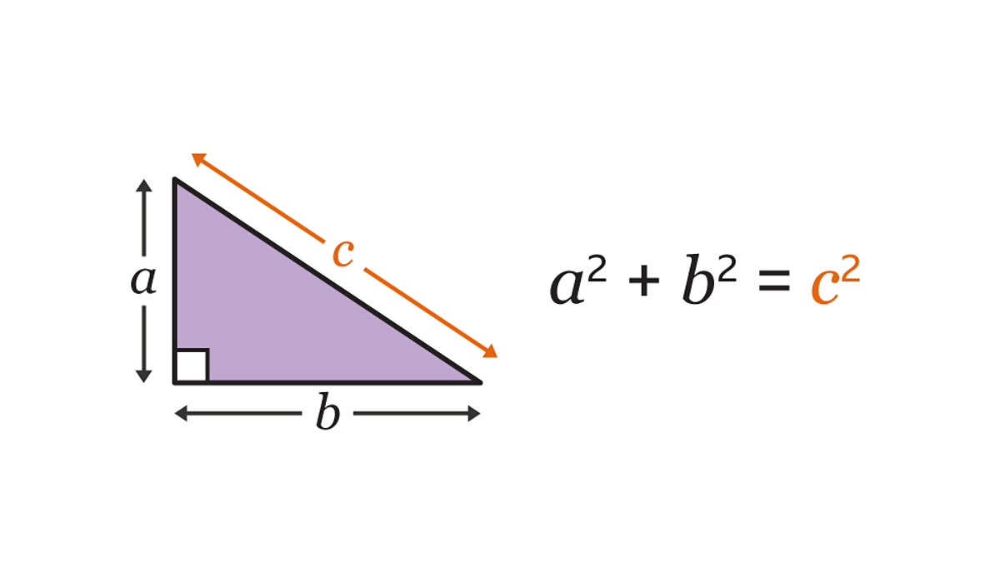

### **Learning Outcomes**

1. **Develop a better understanding of geodesy concepts**
2. **Apply mathematical concepts to geographic data**
3. **Transform positions between horizontal reference frames**
4. **Use R to explore numerical and geographic data** 

<br>

*Be sure to read all sections following the questions for essential information*

<br>

___

## **Lab Questions:**

This document contains a detailed guide with sections to help in completing each question.

Submit your R script and responses to each questions in the Lab 2 Canvas assignment (*include a short code snippet for each step*)

#### **Questions:**

1. Using the information provided below, Calculate the semi-minor axis of the GRS80 ellipsoid, which is the basis for NAD83 and and is applicable to ITRF and IGS.
2. Calculate the difference in ellipsoid radius at the poles compared to the equator.
3. If you were tasked with drilling a hole to the center of the Earth, and wanted to minimize the distance to be drilled, where would you go to do it?
4. Imagine you're working on two field projects in UTM Zone 12N. In both cases, you're walking along an east-west path that is 1 km long, counting the number of Great Basin Sagebrush plants within 10 meters of your path. The first project is located at an easting of 500,000 meters (center of UTM Zone). The second project is located at an easting of 750,000 meters (closer to the edge of the zone, where distortion is more noticeable). You're trying to understand whether the distortion will significantly affect your measurements. What would the apparent plant density be at the edge compared to the center due to distortion from the projection alone?
      * *Hint: compare the ratios of* ${plants}/{distance}$ *between locations*

*Read the R basics section for the next several questions*

Load the following matrix array into `RStudio` (copy/paste and run in your script):

```r
# load in coordinates
p1 <- matrix(c(
  -111.71452, 40.27809,
  -111.71459, 40.27809,
  -111.71453, 40.27816,
  -111.71454, 40.27809,
  -111.71452, 40.27805,
  -111.71451, 40.27806,
  -111.71454, 40.27806,
  -111.71452, 40.27803,
  -111.71453, 40.27807,
  -111.71455, 40.27799
), ncol = 2, byrow = TRUE)
colnames(p1) <- c("x", "y")
```

This includes 10 GPS points collected from the same location using a phone.

5. Calculate the average coordinates for longitude (x) and latitude (y).
6. Calculate the standard deviation of each coordinate. Convert these values to meters.
      * *the conversion is* `1 deg ≈ 111,319 m` *for latitude and* `1 deg ≈ 84,964 m` *for longitude (based on our latitude).* 
7. What do the mean and standard deviation values represent for these data? 
8. Calculate the linear distance (*Euclidean distance in our case*) between the 2nd, 3rd and 9th coordinates in `p1` in meters. How do these distances compare with your standard deviation listed above?
      * *Hint: convert you x and y differences to meters prior to calculating distance*
      
9. Create a basic scatterplot in R using the base `plot` function to show the GPS measurements. Add a center point and buffer for the first and second standard deviation around your center point. Follow these steps and use the code below:
      * First, calculate the individual differences between your longitude (x) & latitude (y) values from your estimated center point. (i.e. all differences in x and y)
      * Second, convert these differences into meters using the same conversion as before
      * Third, assume a center point of (0, 0) and use trigonometry to create coordinates to draw a circle based on the standard deviations you calculated for x and y
      * Visualize your results (see below)


For question 9, the third step, use the following in a script:

```r
# define center points (since we are plotting differences from mean)
center_x <- 0
center_y <- 0

# create angles
theta <- seq(0, 2*pi, length.out = 200)

# parametric equation of an ellipse (1 sd)
ellipse_x <- center_x + sd_x * cos(theta)
ellipse_y <- center_y + sd_y * sin(theta)

# create ellipse for 2nd sd
# ...add your code here
```

For question 9, fourth step, use this for the final plot:

```r
# plot the original points (use asp=1 to maintain aspect ratio)
plot(x_differences, y_differences, asp = 1, pch = 19, col = "black", cex=0.6,
     xlab = "East–West", ylab = "North–South",
     main = "GPS accuracy")

# ^...update names for 'x_differences' and 'y_differences'

# add sd ellipses
lines(ellipse_x, ellipse_y, col = adjustcolor("firebrick", 0.6), lty = 2)

# add 2nd sd ellipses
# ...add your code here

# add center point
points(0, 0, pch = 3, col = "gray", cex = 1.2)

# add a legend (optional)
# ...

# add your sd values (optional)
# ...
```

<br>
  
There are **two options** for the next question:

- (potentially easier) Continue using R, with the provided information and code snippets. 
- Export your data (p1 & mean) as a csv file and read it in as XY data into ArcGIS Pro. 


10. Convert points into geospatial data using either R or ArcGIS. Load the data with the CRS defined as *WGS84* (correct for GPS) and again (incorrectly) as *NAD27* and *NAD83* (both of which use different datums). You will then force the two incorrect NAD data back into WGS84. Provide the **average distance between all points** and indicate the **direction** of shift for both NAD27 and NAD83 compared with WGS84. This demonstrates how incorrectly assigning a CRS will impact your results.
      * For ArcGIS: use the XY to Table, Project, Define, and distance-based functions
      * For R: Install and load the `terra` package (see details at end of doc). Then follow the steps below to create a SpatialVector object with the `vect` function to create spatial point datasets.

```r
# load in data correctly
p1_wgs <- vect(p1, type="points", crs='epsg:4326') # WGS84 ellipsoid

# incorrectly load other data
p1_nad27 <- vect(p1, type="points", crs='epsg:4267') # NAD27 Clark 1866 ellipsoid
p1_nad83 <- vect(p1, type="points", crs='epsg:4269') # NAD83 (1986)

# project to same reference frame (still incorrect)
p1_nad27 <- project(p1_nad27, 'epsg:4326')
p1_nad83 <- project(p1_nad83_1, 'epsg:4326')

# calculate distances
distance(p1_wgs, ..., pairwise=T)

# calculate mean distance for both
# ...add your code here

# plot results (optional)
par(mfrow=c(1,2)) # side-by-side
plot(ext(buffer(p1_wgs, 80)), main='WGS84 vs NAD27') # larger window
plot(p1_wgs, add=T) # correct points plot 1
plot(p1_nad27, col='red', pch=3, add=T) 
plot(p1_wgs, main='WGS84 vs NAD83') # correct points plot 2
plot(p1_nad83,col='red', pch=3, add=T)
```
<br>

11. Use the provided table of GPS measurements from a previous year to calculate the center point for each corner of the ponds (P1-5), calculate the distances between each point and use these to estimate the dimensions of the pond. How close to the truth do you think these results are? (consider the standard deviation of each corner) 
        * You may use R, ArcGIS Pro, or Excel for this step
        * (optional) Use these points to create a polygon and estimate the area. Could also compare with basemaps. 


12. Follow along on Dr. Bund's instructions in the attached document to explore epochs. List your coordinates in two separate dataframes and list teh distance between the two.

<br>

*Please reach out for help asap if you need it!*

<br>


___

## **Section 1:** Shape of the Earth and Ellipsoid

Important vocabulary:

| Term      | Explanation                                                              |
| --------- | ------------------------------------------------------------------------ |
| Datum     | Reference point or surface for measuring locations on Earth.             |
| Ellipsoid | A mathematically defined, smooth shape approximating Earth's shape.      |
| Geoid     | The shape of Earth's mean sea level, used as a vertical reference.       |
| GCS       | Geographic Coordinate System, using latitude and longitude.              |
| WGS84     | A global datum and coordinate system used by GPS.                        |
| NAD       | North American Datum, used mainly in North America (e.g., NAD27, NAD83). |
| PCS       | Projected Coordinate System, converting 3D Earth to flat maps.           |
| UTM       | Universal Transverse Mercator, a common projected coordinate system.     |


<br>


The Earth is not a perfect sphere but an ellipsoid, slightly flattened at the poles. The **semi-major axis** is the longest diameter of the ellipsoid, stretching from the center to the surface at the equator. This is a key parameter in most Earth models like **WGS84** and **GRS80**. The **semi-minor axis** is the shorter diameter, with a radius from the center to a pole.


For example, the **GRS80 ellipsoid** (used to define NAD83) has the following properties:

* Semimajor axis (equatorial radius): **6,378,137 meters**
* Flattening (f): **1 / 298.257222101**


Flattening is calculated as:

$$
f = \frac{a - b}{a}
$$

where:

* $a$ = semimajor axis
* $b$ = semiminor axis (polar radius)

Note that you can use the information above to find information about the semi-minor axis and the difference between the two axes for an ellipsoid. 

**Purpose:** You will respond to a few questions about the ellipsoid in this assignment.

<br>

___

## **Section 2:** UTM Zones, Scaling, and Distortion

UTM divides the world into 60 zones, each 6 degrees wide. Zone 12N covers longitude 114°W to 108°W in the Northern Hemisphere.

Because UTM projects the curved Earth onto a flat surface, there is distortion, especially toward the edges of each zone. Distortion increases as you move east or west from the central meridian of the zone.

* The scale factor at the central meridian (500,000) is 0.9996 (slightly less than 1), reducing distortion near the center.
* At about 3° east or west from the center, scale factor approaches 1 (no scale distortion).
* Beyond that, scale distortion increases. For example, around 750,000 m  the scale factor increases to 1.0010 (*approximate, varies by latitude*)

**Purpose:** You will use this information to calculate the amount of distortion that could occur from using this projection.

<br>

___

## **Section 3:** Calculating Distance with Pythagorean Theorem

When working with points on a flat surface (like a map or a local projected coordinate system), we can measure the straight-line distance between two points using the **Pythagorean Theorem**. Condiser the following figure and recall the basic relationship with right triangles:

```{r include_image, echo=FALSE, out.width="50%"}

```

*source: BBC*

This same concept can be used with spatial data. If you know the coordinates of two points — say, $(x_1, y_1)$ and $(x_2, y_2)$ — the distance between them is the length of the hypotenuse of a right triangle. We can rewrite the equation above as:

$$
\text{distance} = \sqrt{(x_2 - x_1)^2 + (y_2 - y_1)^2}
$$

This method works well for **short distances** or in **planar coordinate systems** like UTM, but it becomes less accurate for long distances on the curved surface of the Earth (where spherical or ellipsoidal formulas are used instead).

Example in R:

```r
x1 <- 1; y1 <- 2
x2 <- 4; y2 <- 6
distance <- sqrt((x2 - x1)^2 + (y2 - y1)^2)
distance
```
Note that `sqrt()` is a built-in R function to calculate the square root. You can look up help for any function by running `?` followed by the function name (e.g. `?sqrt`). You can also use the *Help* tab in the lower right window.

**Purpose:** You will used this step to calculate the distance between your measured points.

<br>

___

## **Section 4:** A Brief Introduction to R

R is a free software environment used for statistical computing and graphics. It is very useful for analyzing data, including geographic information, because it can handle numbers, tables, and even geographic coordinates and map projections easily.

You can download R for free from: 

* CRAN: [https://cran.r-project.org/](https://cran.r-project.org/). 
* After installing R, you can also install RStudio, which is a user-friendly interface for R, from [https://posit.co/download/rstudio-desktop/](https://posit.co/download/rstudio-desktop/).

**Lab computers should have R & RStudio pre-installed**

> **Open RStudio**

In the console, copy and paste this code:

```r
print("hello geospatial world!")
```

click `enter` on your keyboard to run the code.

Great work! You ran your first bit of code.

Below we will cover a few important operations in R to help with this weeks assignment. **Prior programming experience is NOT necessary to complete this assignment!**

<br>

___

#### **R Basics:** Arithmetic, Variables, Structures, and Functions

R can be used like a calculator:

```r
2 + 3  # adds two numbers
5 * 4  # multiplies two numbers
```

You can store values in variables to use in equations:

```r
x <- 10
y <- 5
z <- x + y  # z is now 15
```

Tables, arrays, and matrices store data in rows and columns, you can use the following functions to create a data structure:

```r
# Create an array (numbers in a sequence)
my_array <- c(1, 2, 3, 4, 5)

# Create a table (similar to data frame)
my_table <- data.frame(Name = c("A", "B"), Value = c(3, 7))

# Create a matrix
my_matrix <- matrix(c(1, 2, 3, 4), nrow = 2, ncol = 2)
```

R includes many other useful **built-in functions** for statistical analysis. Here are three commonly used ones:

* `mean()` – calculates the **average**
* `sd()` – calculates the **standard deviation**
* `sum()` – adds all the values

Here is an example of how these can be used:

```r
numbers <- c(5, 10, 15, 20)

mean(numbers)  # returns 12.5
sd(numbers)    # returns 6.454972
sum(numbers)   # returns 50
```

These functions make it easy to quickly summarize and understand your data.

Finally, we should cover how to subset data for more flexible use. In R, **indexing** means accessing specific elements from a vector, matrix, or other data structure.

You can access elements of a vector using square brackets:

```r
v <- c(10, 20, 30, 40)
v[1]     # returns 10 (first element)
v[3]     # returns 30 (third element)
```

Matrices use two indices: `[row, column]`

```r
m <- matrix(1:9, nrow = 3, byrow = TRUE)
m[1, 2]  # element in first row, second column
m[3, ]   # entire third row
m[, 1]   # entire first column
```

Indexing helps you extract or modify parts of your data for analysis.

For example, if you wanted to take the average and standard devaition of separate columns in a matrix, you could do the following:

```r
# combine indexing and functions
mean(m[, 1])  # the mean value of the first matrix column
sd(m[, 2])    # the standard deviation of the second column
```
Additional functions can speed this process up, such as `apply` or `colMeans`, but these are not necessary for this lab.

**R is like Excel**, only much more flexible, more useful, and much more powerful in the long run. Students should learn to use this valuable tool.


___

#### **R Basics:** Reading and Plotting Point Data

Here is how to create a simple matrix with two points (x, y) and plot them:

```r
points <- matrix(c(1, 2, 3, 4), ncol = 2, byrow = TRUE)  # two points: (1,2) and (3,4)
colnames(points) <- c("x", "y")

plot(points, xlab = "X Coordinate", ylab = "Y Coordinate", main = "Simple Plot of Points")

# or with individual variables
x <- c(1, 3)
y <- c(2,4)
plot(x, y)
```

See more with the `?plot` function.

___

#### **R Basics:** Annotating Code and Saving Files and Code

Comments help explain your code and start with `#`:

```r
# This calculates the sum of two numbers
a <- 5
b <- 7
sum <- a + b  # sum equals 12
```

These lines will not be run and are intended to help you and others understand what is going on.

R runs code in the console, but it can be usefult to write and save your code. An **R script** is a plain text file that contains a series of R commands. The file usually ends in `.R`. You can open and edit R scripts in RStudio or any text editor.

Using an R script is helpful because:

* It **saves your work**, so you don’t have to retype commands every time.
* You can **run your code in parts**, making it easier to test and debug.
* It helps you **stay organized** by keeping all your analysis steps in one place.
* You can **add comments** (using `#`) to explain what each section of your code does.

To create an R script in **RStudio**:

1. Go to the top menu and click `File` → `New File` → `R Script`.
2. Save the file using `File` → `Save` (use `.R` as the file extension).
3. You can run a line or section of code by highlighting it and pressing **Ctrl + Enter** (or **Cmd + Enter** on Mac).


___

After creating or modifying data in R, you may want to save it so you can use it later or share it with others. One common format for saving data is **CSV (Comma-Separated Values)**, which can be opened by many programs like Excel.

To save a table or data frame as a CSV file, use the `write.csv()` function:

```r
# Create a simple data frame
my_data <- data.frame(Name = c("Alice", "Bob"), Score = c(90, 85))

# Save it as a CSV file named "my_data.csv"
write.csv(my_data, file = "my_data.csv", row.names = FALSE)
```

* `file` specifies the name of the file to save.
* `row.names = FALSE` prevents R from adding row numbers as a separate column.

This file will be saved in your current working directory, which you can check with `getwd()` or change with `setwd()`. You can also specify another path in the filename. 

You can read in tabular data with `read.csv(csv_filename)` or `read.table` for other specific tabular files.


___
#### **R Basics:** Other functions

In R, you can add extra tools called packages. Packages extend R’s capabilities for specific tasks like mapping or data analysis. To install a package, use:

```r
install.packages("packageName")
```

And to use it in your code, load it with:

```r
library(packageName)
```

This is one of the greatest advantages that R (and other open-source programming languages) have over ArcGIS Pro.

*One Final Note:*

In general, R is similar in capabilities and functionality to Matlab, Python, Julia, and other programming software. There is no *best* programming language to learn, all have their strengths. In today's geospatial world, the most important  thing is that you learn *some* bit of programming to keep up with this rapidly evolving field! It is also useful in many other settings.

<br>


___

## **Section 5:** Spatial Data in R with `terra`

The `terra` package is used to work with spatial data. Note, that you will need to install this package, which may not work on any computer without properly installing other dependencies. This should work well in the lab.

Install and load `terra`:

```r
install.packages("terra") # only need to do once
library(terra) # must do everytime you open a new R session
```

Create point data and assign a coordinate system:

```r
# Create points
points <- vect(matrix(c(-111.7153362, 40.27748851,
                        -111.7154452, 40.27747235,), ncol=2, 
                      byrow=TRUE), type="points")

# Assign coordinate system information (WGS84)
crs(points) <- "+proj=longlat +datum=WGS84 +no_defs"

```

The `crs()` assignment step above is the coordinate reference system assignment. This includes all necessary information about the ellipsoid, datum, and even projection required in spatial data.

```
crs(points) <- "EPSG:4326"  # WGS84
```

Other common EPSG codes:

* NAD27: "EPSG:4267"
* NAD83: "EPSG:4269"
* UTM Zone 12N (WGS84): "EPSG:32612"

Geographic data can be visualized in many ways, we'll keep it simple for now. 

R can be an incredibly capable GIS but the workflow for interacting with geographic data is different (scripting-based rather than a visual map interface). We may use R a bit more this semester but more experience using R or python as a GIS is covered in GEOG 3440 and other courses.


<br>
<br>


Acknowledgments:

*This document was created with assistance from OpenAI's ChatGPT language model to help structure and draft explanations.*

